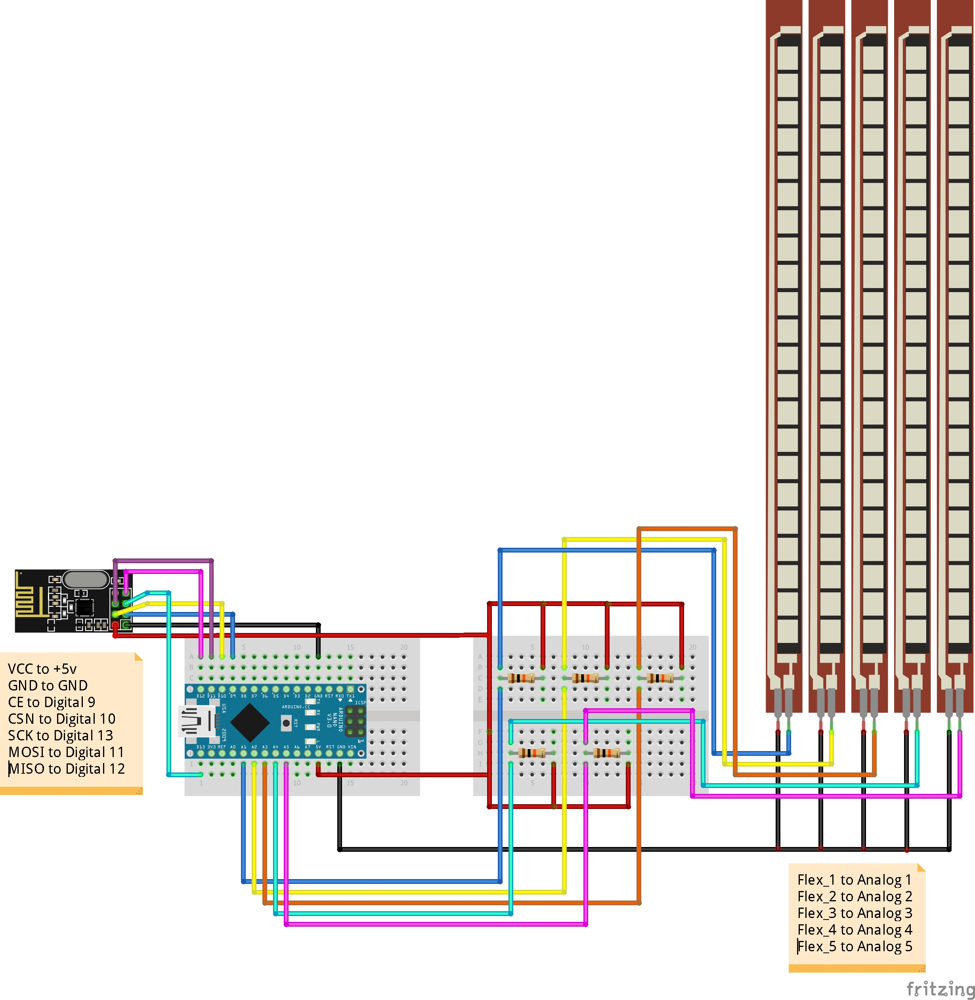
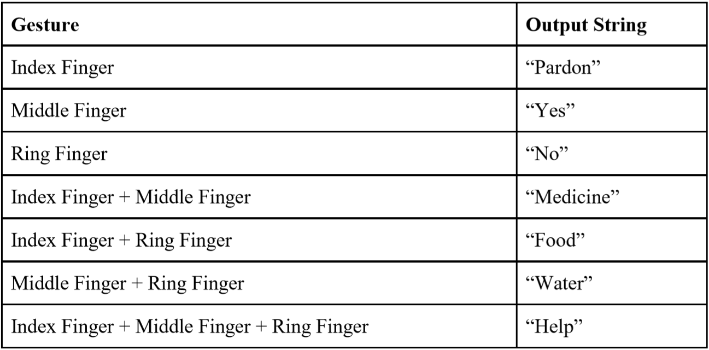
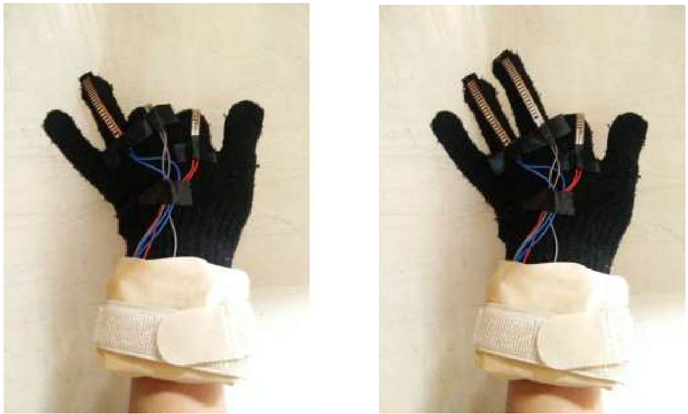
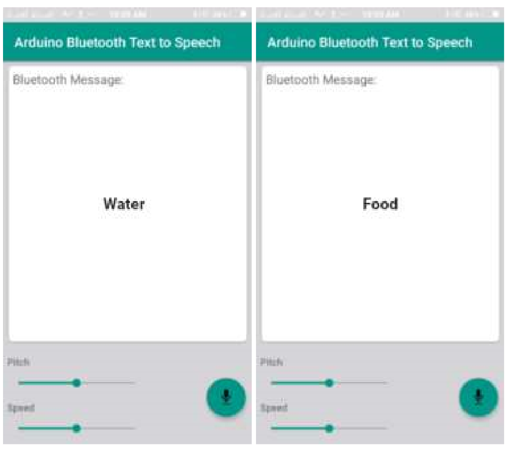

# Gesture-gloves
The project is initiated to help speechless patients to convey their messages remotely to people(care taker, family members, etc).  
The project uses wireless buetooth technology for sending and receiving messages between the glove and an android application which gives audio and text output.

### CIRCUIT DIAGRAM 

 
 

### REFERENCE TABLE

 
 

### INPUT with Glove: Gesture

 
 

### OUTPUT on Android Application: Text and audio

 
 
